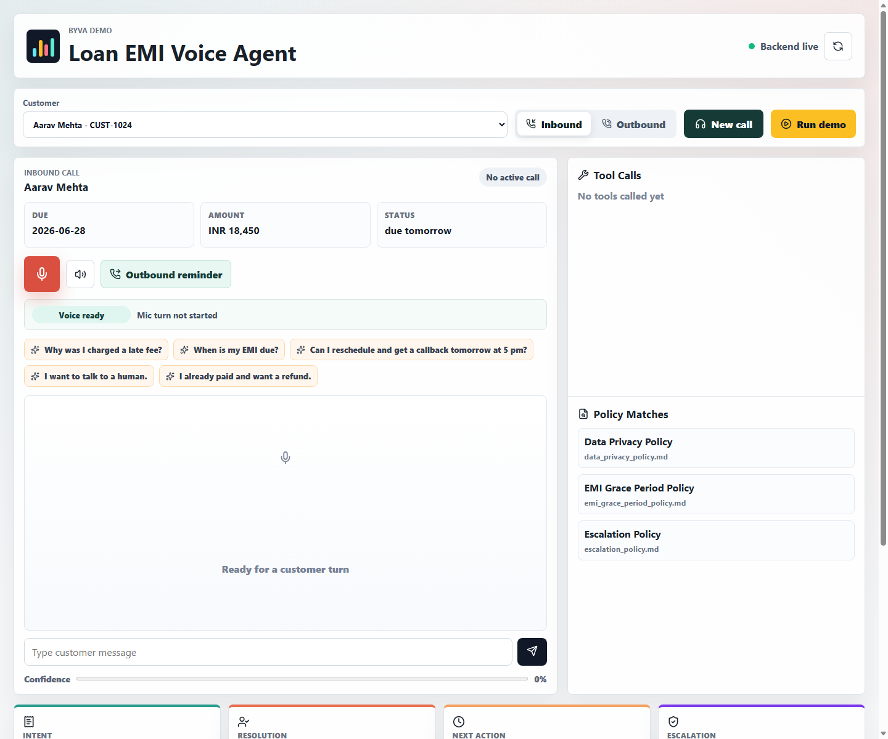

# BYVA Loan EMI Reminder + Customer Support Voice Agent

A polished demo for a BFSI-style voice agent: inbound support, outbound EMI reminders, function calling, RAG over policy docs, human handoff logic, transcripts, and analytics.

## Screenshot



## What It Does

- Handles inbound questions about EMI due date, late fee, payment status, callbacks, refunds, privacy, and human handoff.
- Starts outbound reminder calls: "Your EMI is due tomorrow. Would you like to pay now, request callback, or speak to support?"
- Uses backend tools: `get_customer_emi_status`, `check_payment_status`, `create_support_ticket`, `schedule_callback`, `handoff_to_human`.
- Retrieves grounded policy context from fake company docs with FAISS-backed hashing vectors.
- Escalates when the customer is angry, requests legal or financial advice, asks for a human, has a complex dispute, or confidence is low.
- Shows transcript analytics: intent, sentiment, summary, resolution status, next action, and escalation reason.
- Uses browser speech recognition for STT and browser speech synthesis for TTS, so the demo runs locally without paid telephony keys.

## Stack

- Frontend: React + Vite
- Backend: FastAPI
- Database: SQLite
- RAG: FAISS + scikit-learn `HashingVectorizer`
- Voice demo: Browser Web Speech API + SpeechSynthesis
- Optional production swap: Vapi/Retell/LiveKit + Deepgram/Whisper + GPT/Gemini/Claude + ElevenLabs/OpenAI TTS

## Run Locally

Backend:

```powershell
cd backend
python -m uvicorn app.main:app --reload --host 127.0.0.1 --port 8000
```

Frontend:

```powershell
cd frontend
npm.cmd install
npm.cmd run dev
```

Open `http://127.0.0.1:5173`.

For recording, click `Run demo`. It automatically shows:

- EMI due question
- Callback scheduling
- Human handoff
- Outbound reminder
- Tool calls, policy matches, transcript, and analytics

## Demo Flow

1. Pick `Nisha Rao - CUST-1188` for a late-fee scenario.
2. Click `New call`.
3. Use quick prompt: `Why was I charged a late fee?`
4. Show the tool call, policy match, transcript, intent, sentiment, resolution, and next action.
5. Use quick prompt: `I want to talk to a human.`
6. Show human handoff and escalation reason.
7. Switch to outbound and show the reminder script.

## API Highlights

- `GET /api/customers`
- `POST /api/calls/start`
- `POST /api/agent/respond`
- `GET /api/calls`
- `GET /api/calls/{call_id}`
- `GET /api/analytics/summary`
- `GET /api/policies`
- `POST /api/tools/webhook`
